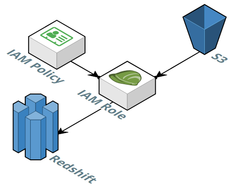

# Data pipeline using Python IaC

Simple project carried out to understand how to create a pipeline and how it works.

Built a data pipeline using Python infrastructure as a code (IaC), between an Amazon S3 Bucket and a cluster from Amazon Redshift.
IaC is the managing and provisioning of infrastructure through code instead of through manual processes, it is border-line dataEng/devOps.

Project consists in creating a pipeline that takes data from an S3 bucket and delivers it onto a Redshift cluster, using PostgreSQL.
First i created the cluster using python, then the tables, and concluded using copy command to insert data into the created cluster.

Implemented the library boto3 (https://aws.amazon.com/es/sdk-for-python/?tag=mochaglobal20-20) to interact with AWS services. The SDK (Software Development Kit) provides an object-orientated API as well as a low-level access to AWS services.

Psycopg2 (https://pypi.org/project/psycopg2/) library was used to manage PostgreSQL SQL queries.
